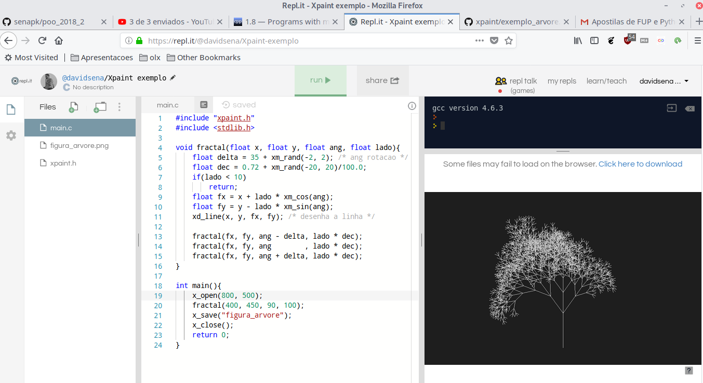

- Baixe a biblioteca do xpaint.h para sua máquina.
- Descreva o que significa cada linha do programa oi.c
- Faça seu desenho do Mickey.
- Faça um desenho de Casinha.
- Você pode usar o repl.it para compilar seus códigos, se estiver com dificuldade de instalar o linux no seu computador ou o mingw no windows.

[link pro repl.it](https://repl.it/@davidsena/Xpaint-exemplo)